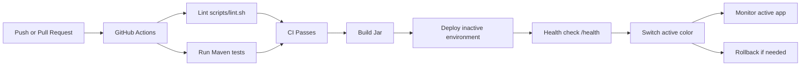

# DevOps Guide

[Application README](../README.md) | [DevOps Guide](DEVOPS.md)

## Tech Stack

- Java 21
- Spring Boot
- Maven
- PostgreSQL for local development
- H2 for tests and local production simulation
- Git and GitHub
- GitHub Actions
- Bash scripts for automation, deployment, rollback, and monitoring
- Swagger UI

## Branches

This repository currently uses:

- `master`: stable branch
- `develop`: active development branch

Typical workflow:

```bash
git checkout develop
git add .
git commit -m "chore: add ci deployment automation"
git push origin develop
```

After the development branch is verified, merge to the stable branch:

```bash
git checkout master
git merge develop
git push origin master
```

Use short, descriptive commit messages such as:

- `feat: add nested task endpoints`
- `test: add api integration tests`
- `ci: run lint and tests`
- `deploy: add blue-green deployment scripts`

## CI

GitHub Actions workflow: `.github/workflows/ci.yml`

It runs automatically on every push and pull request:

1. `./scripts/lint.sh`
2. `./mvnw test`

Local equivalent:

```bash
./scripts/lint.sh
./mvnw test
```

## CI/CD Workflow Diagram



## Environment Preparation

```bash
./scripts/prepare-env.sh
```

This checks required tools, creates the local production directories, and writes deployment configuration under:

```text
/tmp/midterm-production
```

Override location with:

```bash
PROD_ROOT=/path/to/prod ./scripts/prepare-env.sh
```

Expected output:

```text
Environment prepared at /tmp/midterm-production
Config written to /tmp/midterm-production/shared/app.env
```

Generated structure:

```text
/tmp/midterm-production/
  blue/
  green/
  data/
  logs/
  shared/
```

## Blue-Green Deployment

```bash
./scripts/deploy-blue-green.sh
```

The script builds and tests the app, deploys to the inactive environment, starts it on the inactive port, verifies `/health`, then switches active environment metadata.

Default ports:

- blue: `8081`
- green: `8082`

For the local simulation, blue and green use separate H2 file databases:

- `/tmp/midterm-production/data/blue`
- `/tmp/midterm-production/data/green`

This allows both local environments to run at the same time.

First deployment example:

```bash
./scripts/deploy-blue-green.sh
curl http://localhost:8081/health
```

Second deployment example:

```bash
./scripts/deploy-blue-green.sh
curl http://localhost:8082/health
```

Verify both local production environments:

```bash
curl http://localhost:8081/health
curl http://localhost:8082/health
```

Expected health response:

```json
{
  "application": "midterm",
  "timestamp": "2026-05-01T12:39:55.276620793Z",
  "status": "UP"
}
```

Check active and previous environments:

```bash
cat /tmp/midterm-production/shared/current
cat /tmp/midterm-production/shared/previous
```

Example after green deployment:

```text
green
blue
```

## Rollback

```bash
./scripts/rollback.sh
```

Rollback switches active environment metadata back to the previous healthy environment.

Example rollback verification:

```bash
cat /tmp/midterm-production/shared/current
cat /tmp/midterm-production/shared/previous
```

Before rollback, after green is active:

```text
green
blue
```

Run rollback:

```bash
./scripts/rollback.sh
```

Expected result:

```text
Rollback complete. Active environment: blue on port 8081
```

Verify metadata again:

```bash
cat /tmp/midterm-production/shared/current
cat /tmp/midterm-production/shared/previous
```

Expected:

```text
blue
green
```

## Monitoring

```bash
./scripts/health-monitor.sh
```

It periodically checks the active environment `/health` endpoint and writes results to:

```text
/tmp/midterm-production/logs/health-check.log
```

Customize interval:

```bash
INTERVAL_SECONDS=10 ./scripts/health-monitor.sh
```

View logs:

```bash
tail -f /tmp/midterm-production/logs/health-check.log
```

Example log line:

```text
2026-05-01T12:41:43Z status=UP env=green port=8082 response={"application":"midterm","timestamp":"2026-05-01T12:41:43Z","status":"UP"}
```

## Screenshot Checklist

Add screenshots under `docs/images/` and embed them here before submission.

Create the folder:

```bash
mkdir -p docs/images
```

### Successful CI Pipeline

Show GitHub Actions passing after a push or pull request.

```markdown

```

### IaC / Environment Preparation

Show successful execution of:

```bash
./scripts/prepare-env.sh
```

```markdown

```

### Blue-Green Deployment

Show successful execution of:

```bash
./scripts/deploy-blue-green.sh
```

```markdown

```

### Running App Health Checks

Show both environments responding:

```bash
curl http://localhost:8081/health
curl http://localhost:8082/health
```

```markdown

```

### Rollback

Show:

```bash
./scripts/rollback.sh
cat /tmp/midterm-production/shared/current
cat /tmp/midterm-production/shared/previous
```

```markdown

```

### Monitoring Logs

Show:

```bash
tail -f /tmp/midterm-production/logs/health-check.log
```

```markdown

```

## Troubleshooting

Stop local production jars:

```bash
pkill -f '/tmp/midterm-production/.*/app.jar' || true
```

Reset local production state:

```bash
pkill -f '/tmp/midterm-production/.*/app.jar' || true
rm -rf /tmp/midterm-production
./scripts/prepare-env.sh
```

The duplicate email warning during deployment tests is expected. The integration test intentionally creates a duplicate student email to verify that the API returns `409 Conflict`.
