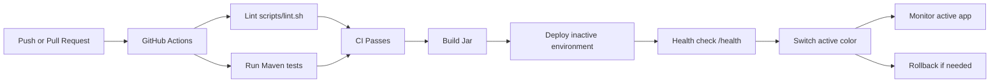
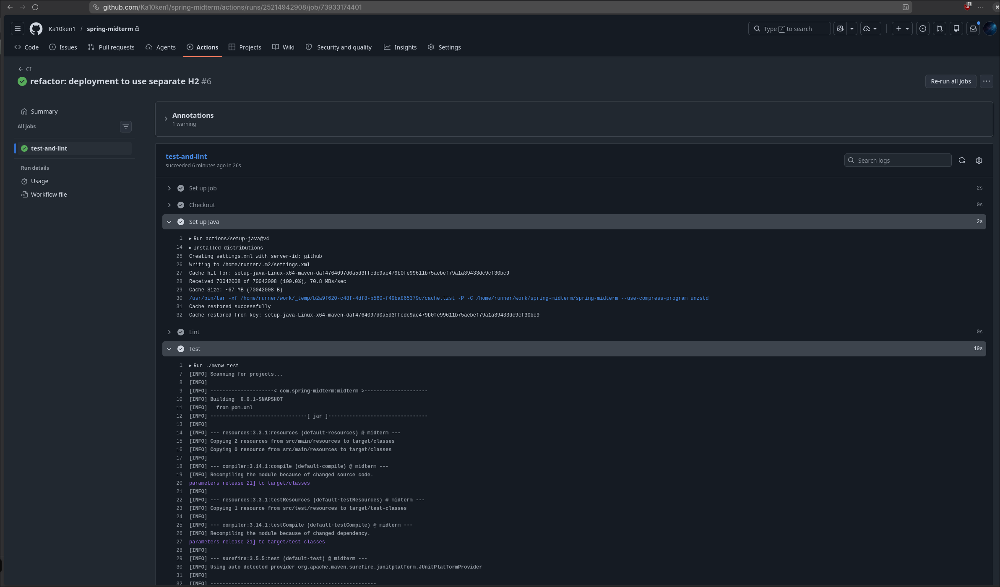
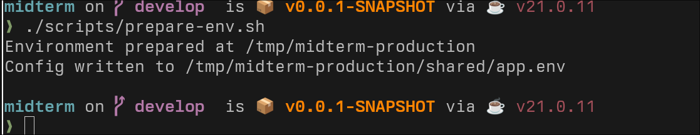
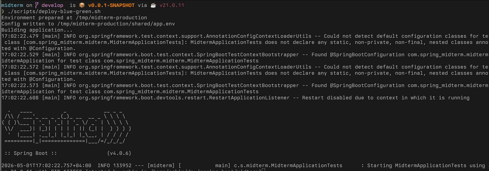
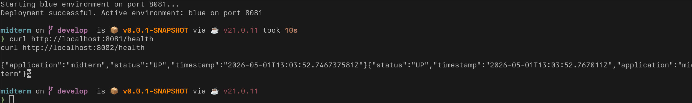
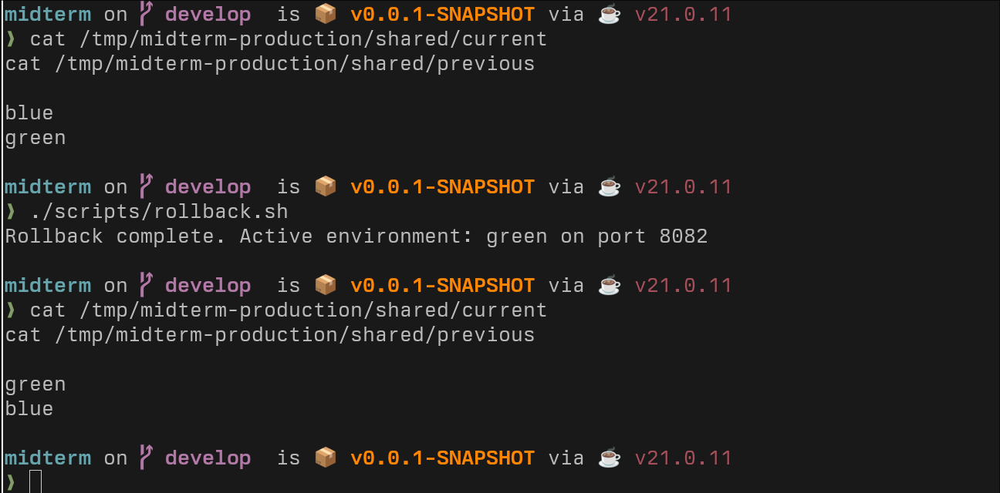
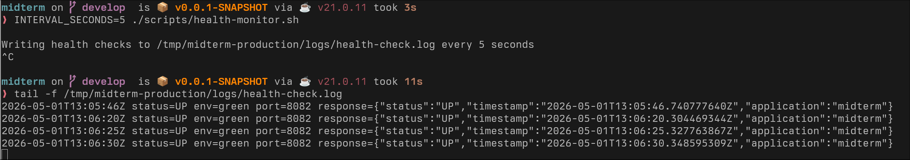
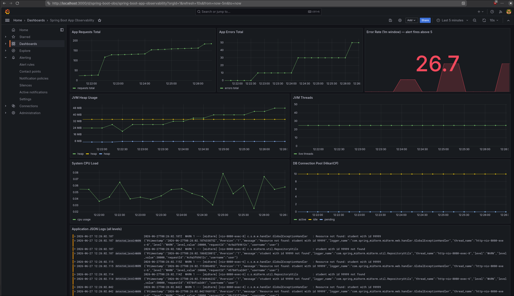
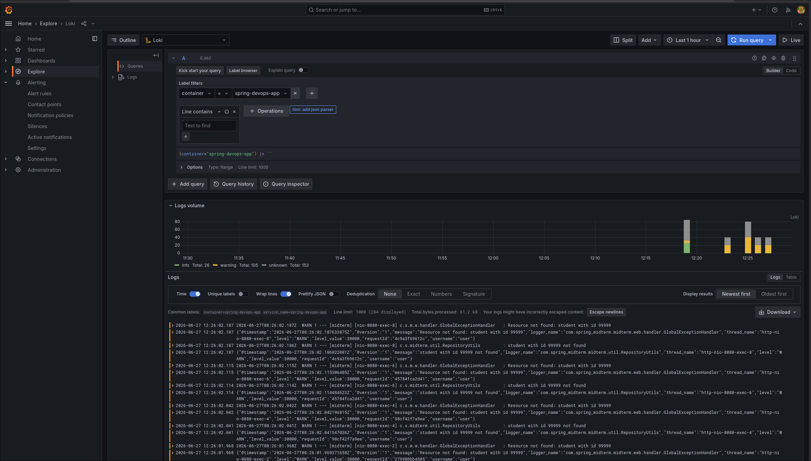

# DevOps Guide

[Application README](../README.md) | [DevOps Guide](DEVOPS.md)

## Tech Stack

- Java 21
- Spring Boot
- Maven
- PostgreSQL for local development
- H2 for tests and local production simulation
- Git and GitHub
- GitHub Actions
- Bash scripts for automation, deployment, rollback, and monitoring
- Docker / Docker Compose
- Prometheus + Grafana for metrics and dashboards
- Loki + Promtail for log aggregation
- OWASP Dependency Check, Trivy, GitLeaks for security scanning
- Swagger UI

## Branches

This repository currently uses:

- `master`: stable branch
- `develop`: active development branch

Typical workflow:

```bash
git checkout develop
git add .
git commit -m "chore: add ci deployment automation"
git push origin develop
```

After the development branch is verified, merge to the stable branch:

```bash
git checkout master
git merge develop
git push origin master
```

## CI

GitHub Actions workflow: `.github/workflows/ci.yml`

It runs automatically on every push and pull request:

1. `./scripts/lint.sh`
2. `./mvnw test`

Local equivalent:

```bash
./scripts/lint.sh
./mvnw test
```

## CI/CD Workflow Diagram



## Environment Preparation

```bash
./scripts/prepare-env.sh
```

This checks required tools, creates the local production directories, and writes deployment configuration under:

```text
/tmp/midterm-production
```

Override location with:

```bash
PROD_ROOT=/path/to/prod ./scripts/prepare-env.sh
```

Expected output:

```text
Environment prepared at /tmp/midterm-production
Config written to /tmp/midterm-production/shared/app.env
```

Generated structure:

```text
/tmp/midterm-production/
  blue/
  green/
  data/
  logs/
  shared/
```

## Blue-Green Deployment

```bash
./scripts/deploy-blue-green.sh
```

The script builds and tests the app, deploys to the inactive environment, starts it on the inactive port, verifies `/health`, then switches active environment metadata.

Default ports:

- blue: `8081`
- green: `8082`

For the local simulation, blue and green use separate H2 file databases:

- `/tmp/midterm-production/data/blue`
- `/tmp/midterm-production/data/green`

This allows both local environments to run at the same time.

First deployment example:

```bash
./scripts/deploy-blue-green.sh
curl http://localhost:8081/health
```

Second deployment example:

```bash
./scripts/deploy-blue-green.sh
curl http://localhost:8082/health
```

Verify both local production environments:

```bash
curl http://localhost:8081/health
curl http://localhost:8082/health
```

Expected health response:

```json
{
  "application": "midterm",
  "timestamp": "2026-05-01T12:39:55.276620793Z",
  "status": "UP"
}
```

Check active and previous environments:

```bash
cat /tmp/midterm-production/shared/current
cat /tmp/midterm-production/shared/previous
```

Example after green deployment:

```text
green
blue
```

## Rollback

```bash
./scripts/rollback.sh
```

Rollback switches active environment metadata back to the previous healthy environment.

Example rollback verification:

```bash
cat /tmp/midterm-production/shared/current
cat /tmp/midterm-production/shared/previous
```

Before rollback, after green is active:

```text
green
blue
```

Run rollback:

```bash
./scripts/rollback.sh
```

Expected result:

```text
Rollback complete. Active environment: blue on port 8081
```

Verify metadata again:

```bash
cat /tmp/midterm-production/shared/current
cat /tmp/midterm-production/shared/previous
```

Expected:

```text
blue
green
```

## Monitoring

```bash
./scripts/health-monitor.sh
```

It periodically checks the active environment `/health` endpoint and writes results to:

```text
/tmp/midterm-production/logs/health-check.log
```

Customize interval:

```bash
INTERVAL_SECONDS=10 ./scripts/health-monitor.sh
```

View logs:

```bash
tail -f /tmp/midterm-production/logs/health-check.log
```

Example log line:

```text
2026-05-01T12:41:43Z status=UP env=green port=8082 response={"application":"midterm","timestamp":"2026-05-01T12:41:43Z","status":"UP"}
```

## Actuator Endpoints

The project exposes two sets of actuator endpoints:

### Custom Actuator (`/actuator/*`)

| Endpoint | Access | Description |
| --- | --- | --- |
| `GET /actuator/health` | Public | Custom health check (DB reachability, JVM memory) |
| `GET /actuator/info` | Public | Application metadata (version, title, contact) |
| `GET /actuator/metrics` | ADMIN | JVM metrics, DB entity counts, custom counters |
| `GET /actuator/metrics/{name}` | ADMIN | Single metric by name |

### Spring Boot Actuator (`/manage/*`)

| Endpoint | Access | Description |
| --- | --- | --- |
| `GET /manage/health` | Public | Standard Spring Boot health (from `spring-boot-starter-actuator`) |
| `GET /manage/info` | Public | Standard Spring Boot info |
| `GET /manage/metrics` | ADMIN | Micrometer metrics (JVM, HikariCP, system, custom) |
| `GET /manage/prometheus` | Public | Prometheus scrape endpoint |

## Incident Response

### Alert severity levels

| Severity | Example | Response |
| --- | --- | --- |
| CRITICAL | Error rate > 5/min for 1m | Immediate investigation; rollback if deployment-related |
| WARNING | High JVM heap usage > 80% | Monitor during office hours; investigate root cause |
| INFO | Health check failure recovered | No action required; logged for audit |

### Runbook

**1. Application down / returns 5xx**
- Check health endpoint: `curl http://localhost:8080/actuator/health`
- Check logs: `tail -f logs/app.log`
- Check Docker containers: `docker compose ps`
- If deployment-related: `./scripts/rollback.sh`
- If DB-related: `docker compose logs postgres`

**2. High error rate alert fires**
- Check Grafana dashboard for error spike patterns
- Query Loki for error-level logs: `{container="spring-devops-app"} \| json \| level="ERROR"`
- Identify whether it's a specific endpoint failing
- If caused by recent deploy: rollback, fix, redeploy

**3. Prometheus / Grafana unreachable**
- Check monitoring containers: `docker compose ps prometheus grafana`
- Restart if needed: `docker compose restart prometheus grafana`
- Check config files for syntax errors

### Service Availability Objectives

| Metric | Target | Measured by |
| --- | --- | --- |
| Uptime | > 99.5% | Health monitor script |
| API error rate | < 1% of requests | `increase(app_errors_total[1m])` |
| Health check pass rate | 100% of probes | `/actuator/health` monitoring |
| Alert response time | < 30 minutes | Incident log |

### Successful CI Pipeline

Show GitHub Actions passing after a push or pull request.



### IaC / Environment Preparation

Show successful execution of:

```bash
./scripts/prepare-env.sh
```



### Blue-Green Deployment

Show successful execution of:

```bash
./scripts/deploy-blue-green.sh
```



### Running App Health Checks

Show both environments responding:

```bash
curl http://localhost:8081/health
curl http://localhost:8082/health
```



### Rollback

Show:

```bash
./scripts/rollback.sh
cat /tmp/midterm-production/shared/current
cat /tmp/midterm-production/shared/previous
```



### Monitoring Logs

Show:

```bash
tail -f /tmp/midterm-production/logs/health-check.log
```



## Docker Compose Observability Stack

The project includes a full observability stack via Docker Compose for one-command environment setup.

### Services

| Service | Image | Purpose |
| --- | --- | --- |
| `postgres` | postgres:16-alpine | Production database |
| `app` | Build from `Dockerfile` | Spring Boot application (docker profile) |
| `prometheus` | prom/prometheus:v2.54.1 | Metrics collection + alert evaluation |
| `grafana` | grafana/grafana:11.2.2 | Metrics + log dashboards, unified alerting |
| `loki` | grafana/loki:3.2.1 | Log storage and query engine |
| `promtail` | grafana/promtail:3.2.1 | Log shipping from Docker containers to Loki |

### Start the stack

```bash
docker compose up --build -d
```

### Access the services

- App: http://localhost:8080
- Prometheus: http://localhost:9090
- Grafana: http://localhost:3000 (`admin` / `admin`)
- Loki: http://localhost:3100 (API only)

### Grafana dashboard

A pre-loaded dashboard ("Spring Boot App Observability") includes:

- **App Requests Total** — cumulative request count (Prometheus)
- **App Errors Total** — cumulative error count (Prometheus)
- **Error Rate (1m window)** — stat panel, alert threshold at 5 (Prometheus)
- **JVM Heap Usage** — heap memory over time (Micrometer + Prometheus)
- **JVM Threads** — live thread count (Micrometer + Prometheus)
- **System CPU Usage** — CPU usage (Micrometer + Prometheus)
- **DB Connection Pool** — HikariCP active/idle/pending connections (Micrometer + Prometheus)
- **Application JSON Logs** — real-time log viewer (Loki)



### Prometheus metrics endpoints

| Endpoint | Auth | Description |
| --- | --- | --- |
| `/actuator/prometheus` | Public | Prometheus scrape endpoint (Micrometer) |

Custom counters registered by `LoggingFilter`:

- `app_requests_total` — incremented on every HTTP request
- `app_errors_total` — incremented on HTTP 4xx/5xx responses

Built-in Micrometer metrics also available: JVM memory, threads, garbage collection, HikariCP pool, system load.

### Prometheus alerting

Alert rule in `prometheus/alerts.yml`:

```yaml
alert: HighApplicationErrorRate
expr: increase(app_errors_total[1m]) > 5
severity: critical
```

Grafana Unified Alerting mirrors the same rule with a visual alerting UI.

Trigger the alert:

```bash
./scripts/trigger-alert.sh
```

Check firing alerts:
- Prometheus: http://localhost:9090/alerts
- Grafana: Alerting → Groups → Midterm Observability


### Logging pipeline

```
App (stdout JSON) → Docker json-file → Promtail → Loki → Grafana
```

The app uses `net.logstash.logback:logstash-logback-encoder` with the `docker` profile to output structured JSON logs (level, message, logger, requestId, username) to stdout. Promtail discovers the container via the Docker socket and ships logs to Loki.

Query logs in Grafana Explore:

```logql
{container="spring-devops-app"}
```

Filter by level:

```logql
{container="spring-devops-app"} | json | level="ERROR"
```



## Security Scanning

Security checks are integrated into the CI/CD pipeline.

### OWASP Dependency Check

The `dependency-check-maven` plugin scans all Maven dependencies for known vulnerabilities (CVEs). It runs during the CI workflow and generates HTML + JSON reports.

```bash
./mvnw dependency-check:check
```

Reports are written to `target/dependency-check-report.html`.

### Trivy Filesystem Scan

Trivy scans the entire project filesystem for vulnerabilities in dependencies, config files, and scripts. It runs as a separate CI job.

```bash
trivy fs .
```

### GitLeaks Secrets Scan

GitLeaks scans the repository for accidentally committed secrets, API keys, and credentials. It runs on every push and pull request.

```bash
gitleaks detect --source . -v
```

### CI Security Workflow

```text
Push / PR → Lint → Test → OWASP Dependency Check (Maven)
         → Build JAR → Trivy filesystem scan → GitLeaks secrets scan
```

The CI workflow includes two parallel jobs: `test-and-lint` (lint, test, OWASP) and `security-scan` (build, Trivy, GitLeaks).

## Troubleshooting

Stop local production jars:

```bash
pkill -f '/tmp/midterm-production/.*/app.jar' || true
```

Reset local production state:

```bash
pkill -f '/tmp/midterm-production/.*/app.jar' || true
rm -rf /tmp/midterm-production
./scripts/prepare-env.sh
```

The duplicate email warning during deployment tests is expected. The integration test intentionally creates a duplicate student email to verify that the API returns `409 Conflict`.
